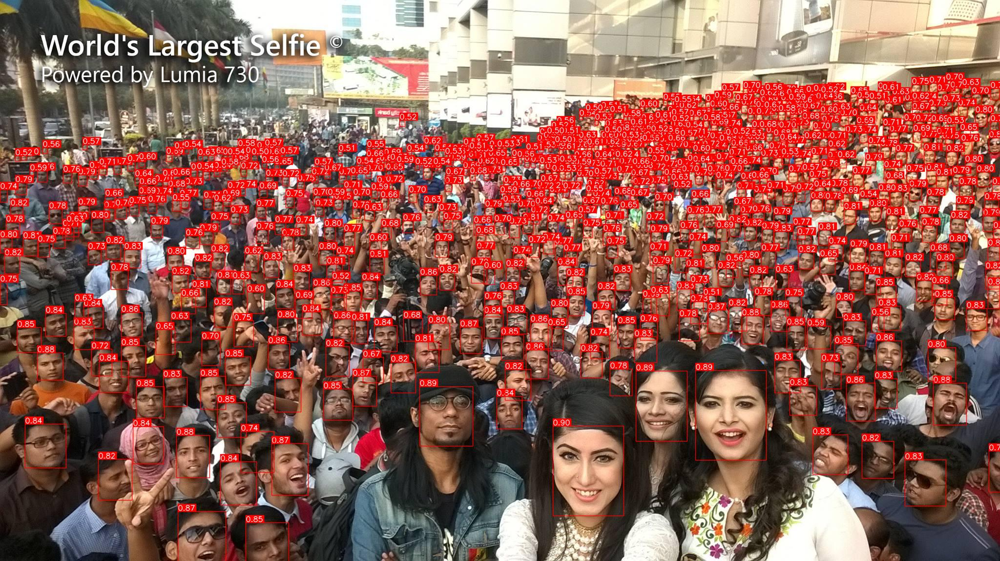

# Yolo Face Detection

## Description
The project is a wrap over [yolov7-face](https://github.com/derronqi/yolov7-face) repo and base on [Elyha7-YOLOFace](https://github.com/elyha7/yoloface). Made simple portable interface for model import and inference. Model detects faces on images and returns bounding boxes and coordinates of 5 facial keypoints, which can be used for face alignment.

## Installation
0. Install suitable version of [pytorch and torchvision](https://pytorch.org/get-started/locally/).
1. Install requirements:
```bash
pip install -r requirements.txt
```

## Prepare pretrained models
0. Run `prepare_models.py -l' to list all available models.
1. Run `prepare_models.py <model_name>` to download and prepare model for inference.

All models are from [yolov7-face](https://github.com/derronqi/yolov7-face) repo.

## Usage
Use following command to run inference on image:
```bash
python detect.py <path_to_image>
```

You can also use following arguments:
```bash
    -w, --weights_name: Name of the model under weights folder
    -c, --config_name: Name of the config file under models folder
    -t, --target_size: Target size of the image, input size of the model
    -d, --device: Device to run inference on
    -m, --min_face: Minimum face size to detect
    --conf: Confidence threshold for detection
    --iou: IoU threshold for NMS
    -l, --return_landmarks: Return facial landmarks
    -dr, --draw: Draw bounding boxes on image
    --save_dir: Directory where to save the image after drawing bounding boxes
```

## Result example


## Citiation
Thanks [yolov7-face](https://github.com/derronqi/yolov7-face) for pretrained models and [Elyha7-YOLOFace](https://github.com/elyha7/yoloface) for inference codebase.
